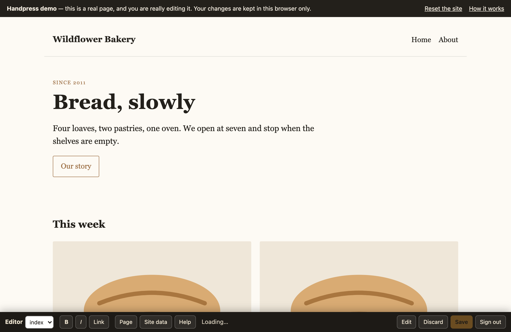
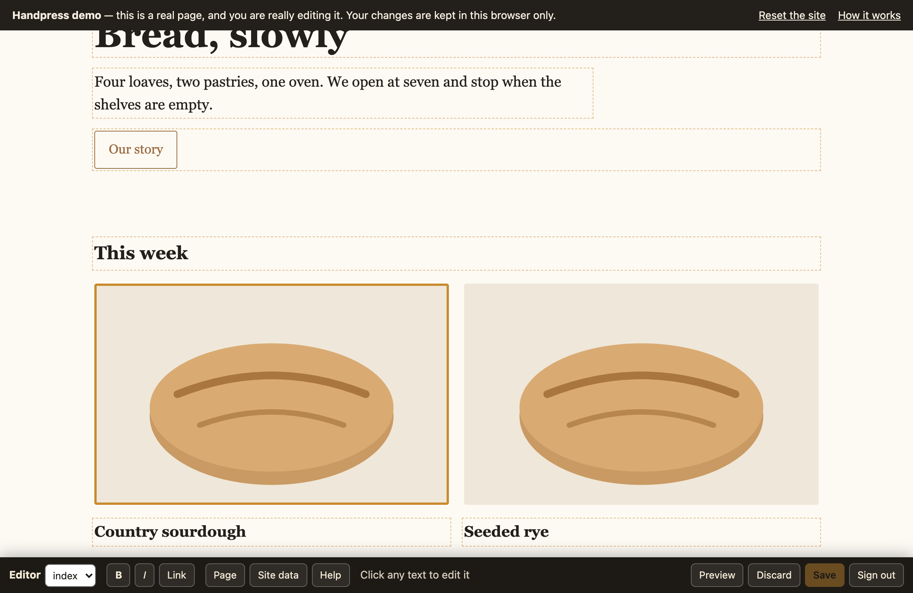
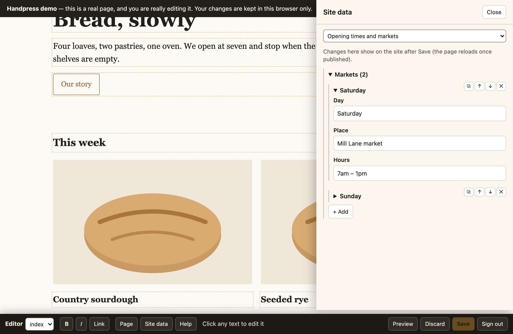

# Handpress

**Let a client edit a hand-written static site — the real pages, in place, in the browser.**
No CMS, no build step, no database. Every save is a git commit.

[](https://github.com/bikramtuladhar/handpress/actions/workflows/test.yml)
[](https://www.npmjs.com/package/handpress)
[](LICENSE)
[](https://www.skills.sh/bikramtuladhar/handpress)

### ➜ [Try the demo](https://handpress-demo.bikramtuladhar2011.workers.dev) — no sign-up; it's a real page and you really edit it
### 📖 [Documentation](https://bikramtuladhar.github.io/handpress/)



```
visitor   →  your static site, exactly as you built it

editor    →  /admin  →  sign in with Google
          →  clicks the page and types
          →  Save    →  one commit  →  live
```

## Why

Most CMSs ask you to break a design into templates and move the words into a database. That is
the right trade for a publication with a thousand posts. It is the wrong trade for a brochure
site of ten careful pages, where the layout *is* the product and the owner wants to fix a date
or swap a photograph twice a year.

Handpress keeps the HTML as the source of truth and teaches the browser to edit it.

- **No templating.** Your markup is untouched except for a small `data-e` key per editable element.
- **No database.** Files in git. Before Save the editor has its own Undo; after it, `git revert`. Backups are your repository.
- **No build.** One JavaScript file, loaded only for signed-in editors. Visitors download nothing.
- **Clean diffs.** A changed sentence is a one-line diff you can review in a pull request.
- **The design can't drift.** New entries are copies of existing ones, so a client cannot invent a layout.

## What the editor does

| | |
|---|---|
| **Text** | Click and type. Bold, italic, links (address, text, new tab). Colour, size and font for selected words or a whole block. Pasted text arrives plain. |
| **Blocks** | Hover any repeating thing — cards, list items, whole sections, buttons — to duplicate, move, delete, style, edit or follow its link. **+** adds after it: a new paragraph, heading or button, or anything copied or removed, from any page. |
| **Drafts** | Unsaved edits are kept in the browser through Preview, page changes and reloads, with a counter. Undo / Redo. One Save commits every edited page. |
| **Drop-downs** | Click a `<select>` to edit its options (label and value). |
| **Images** | Click to replace (resized in the browser first) and edit the alt text. |
| **Video and audio** | YouTube embeds take a new link; audio players take a new file (mp3, m4a, ogg). |
| **Shared blocks** | Edit the header or footer once; it is written to every page. |
| **Page settings** | Title, meta description, and the text shown when the page is shared. |
| **Site data** | A form over your JSON data file, for lists the site renders from data. Lists on the page get handles too (move, duplicate, edit, remove, add, add images), and redraw as they change. |
| **Guide** | Tips for each page, with a *Show me* button; opens by itself the first time a page is edited. |
| **AI assistant** | Hover a block → **AI** to rewrite its text, or the **AI** bar button to write a whole new block — free models through [OpenRouter](https://openrouter.ai) (your own free key, kept in the browser, sent only to OpenRouter). It writes with your site's design: colours, classes, section shapes and voice (see `EDITOR_HOOKS.ai`). AI edits undo, draft and Save like any typed change. |




## Quick start

```sh
npm i -D handpress

npx handpress install ./public                                  # editor.js + admin.html
npx handpress keys "public/*.html" --global "header, footer"     # add the editing keys
```

Then one line in your site's own JavaScript, so visitors never load the editor:

```js
if (/(?:^|;\s*)ed=1/.test(document.cookie)) {
  var s = document.createElement('script'); s.src = '/editor.js'; s.defer = true;
  document.head.appendChild(s);
}
```

And a back end. On Cloudflare, point a Worker at `src/worker.js`:

```jsonc
"vars": {
  "GITHUB_REPO": "you/your-site",
  "GITHUB_BRANCH": "main",
  "GOOGLE_CLIENT_ID": "…apps.googleusercontent.com",
  "EDITOR": {
    "pages": ["index.html", "about.html"],        // the only pages that can be edited
    "dataFiles": { "data.js": "Opening times" },   // window.NAME = { …valid JSON… };
    "globalBlocks": ["header", "footer"],          // edited once, written to every page
    "uploadDir": "uploads",
    "forceVisible": "[data-reveal]"                // if you animate things into view
  }
}
```

```sh
wrangler secret put GITHUB_TOKEN     # fine-grained, this repo only, Contents: read and write
wrangler secret put SESSION_SECRET   # openssl rand -hex 32
wrangler secret put ADMIN_EMAILS     # comma-separated Google addresses allowed to edit
```

Create a Google OAuth client (Web application), list your site's origin under *Authorized
JavaScript origins*, deploy, and visit `/admin`.

Not on Cloudflare? The PHP half ships with it, and saves publish **instantly** because the files
are right there:

```sh
npx handpress install ./public_html --php     # api.php + Apache templates + sample settings
```

[Step-by-step guide for cPanel hosting](https://bikramtuladhar.github.io/handpress/cpanel.html) ·
[notes for other hosts](docs/other-hosts.md)

## How it works

| | |
|---|---|
| `src/annotate.mjs` | Run over your pages once. Adds `data-e` keys so the editor can match an element in the live page with the same element in the file. |
| `src/editor.js` | The browser half. Fetches the page's **source**, keeps it as a second DOM, and applies each edit to both. |
| `src/worker.js` | The server half. Google sign-in, a strict allowlist, one commit per save. |

The two-DOM trick is the heart of it. A live page has been rearranged by your own JavaScript:
lists rendered, counters animated, classes toggled. Saving what is on screen would bake all of
that into the file. So the editor edits the *source* by key and writes that; the live page is
only a preview.

Every change is a small operation kept in the browser until Save, so unsaved edits survive
Preview, other pages and reloads (they are replayed on load), and Undo / Redo are just dropping
and restoring the last one. Save replays each edited page's operations onto the current file and
commits everything in one go.

## Security

The trust boundary is the admin list: anyone on it can change any editable file, and editing
HTML means they could insert a script. Keep it short.

Everything else is closed by default:

- Any path not in `pages`, `dataFiles` or `uploadDir` is refused for reads and writes,
  **including for a signed-in admin**.
- Sign-in needs a Google ID token that Google validates, plus a match on the admin list. There
  is no password to guess.
- The session cookie is HttpOnly, Secure, SameSite=Strict — which is also why no CSRF token is
  needed — and writes must be JSON, which a cross-site form cannot send.
- Every save carries the hash each file was loaded at. If someone saved in between, the whole
  save is refused rather than overwriting their work.
- Uploads are limited by extension and directory. On a host that executes files, also deny
  execution in the uploads directory (see `docs/other-hosts.md`), and test it.
- The only outside hosts are `accounts.google.com` (the sign-in button),
  `oauth2.googleapis.com` (checking the sign-in token) and, for the Worker, `api.github.com`
  (reading files and committing saves; `GITHUB_API` overrides it). The PHP half writes to disk
  and never calls GitHub. There is no telemetry.

## Working on Handpress

```sh
npm install
npm test            # sessions, the allowlist, the file checks, the keying script
npm run example     # the sample bakery site on wrangler dev
npm run demo:build  # regenerate demo/ from the example
```

`npm run test:browser` drives the example in a real browser — the guide, list handles on the
data-drawn markets with a live redraw, copying a section, text and shared-block edits, duplicate,
undo / redo, a reload mid-draft, the data file, save — against a stand-in GitHub, then checks
what was committed. It needs `playwright-core`, a local Chrome, and the two processes named at the top
of `test/browser.mjs`.

## Using it with an AI assistant

Handpress ships an agent skill — when it fits, how to install it, the failure modes, and what
to verify before handing a site to its owner:

```sh
npx skills add bikramtuladhar/handpress          # Claude Code, Cursor, Codex, OpenCode, and ~75 more
npx skills use bikramtuladhar/handpress@handpress | claude    # or use it without installing
```

Or copy [`skills/handpress/SKILL.md`](skills/handpress/SKILL.md) to `.claude/skills/handpress/SKILL.md`
yourself — it is a plain Markdown file with front matter.

## Status and limits

Early, but not theoretical: it runs a real client site, edited by its owner.

Deliberately missing: server-side drafts (unsaved edits live in one browser), approval workflow,
multiple simultaneous editors (a second concurrent save is refused, not merged), and any
notion of content types. If you need those, use a CMS.

MIT licensed. Issues and pull requests welcome.
